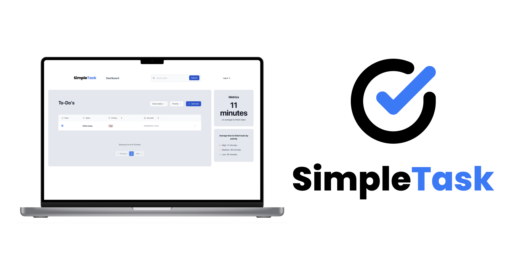

# SimpleTaskWeb

### Description
SimpleTask is my first Breakable Toy in the Spark Program @ Encora. It is a task management web app built with Spring boot and Java in the backend and React + TypeScript + Tailwind in the frontend.

### Technologies

**Frontend**
- React JS
- TypeScript
- Vite
- Tailwind

**Backend**
- Spring Boot
- Java
- Java Collections in order to emulate a DB.

## How to run

1. Download the project in your workspace.
2. Open a terminal and enter the backend folder with the following command:
`cd SimpleTaskWeb/backend/`
3. Run the project with Maven.
Make sure to have installed Maven.
`mvn spring-boot:run`
4. Once the backend is running, open another terminal and enter into the frontend folder:
`cd SimpleTaskWeb/frontend/`
5. Run the project with npm.
Make sure to have installed npm.
`npm run start`
6. Open the web app.
The frontend is running on the following address:
`http://localhost:8080/`
7. Enjoy the app. 🎉 

